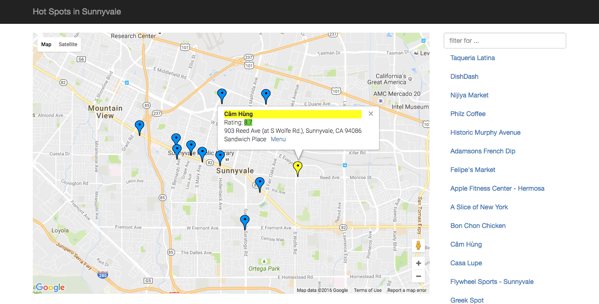
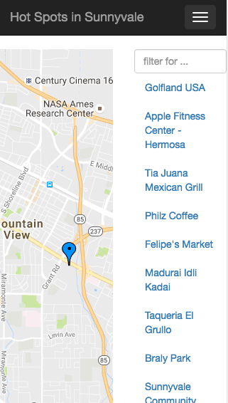
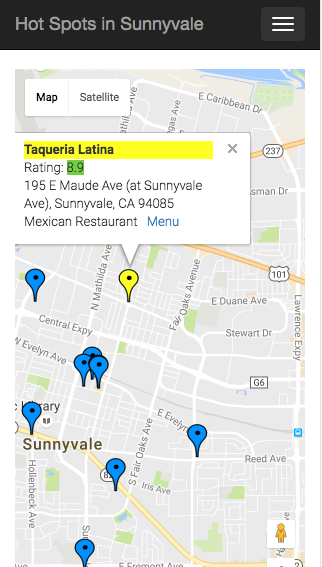

## Neighborhood Maps
The maps look like this

Map shows locations and info window along with Filter option

   

This web app is mobile responsive.

Neighborhood maps is a single-page application featuring a map of Sunnyvale.

The map has markers to identify popular locations or places in the city.

The markers are annimated when the user mouses over them.

This application uses FourSquare API to provide additional information about each of these locations, including color-coded ratings and if available a link to it's menu. This detailed information is shown on a info window when a marker is selected or a list item associated with it is selected.

The page has a search/filter box to easily discover these locations and a listview to support simple browsing of all locations. The list view and markers update accordingly in realtime.

The site is made responsive using Bootstrap and some custom css . A hamburger menu icon is used to show or hide the list on small screen.

It uses Google Maps API and Four Square API to show maps and locations. These API's are called asyncronously and a message is shown in case the call to the API's fail.

## The repository uses the following files :

* **index.html**: The main HTML document. Contains links to all of the CSS and JS resources needed to render the map and locations. It also loads results of  Google Maps API asyncronously.

* **js/getLocations.js**: Contains all the java script and KnockOut.js code used to build the map. It makes an ajax call to FourSquare API to get the deatails of hot spots in Sunnyvale.

* **js/offcanvas.js**: Contains the code to add a hamburger menu icon that is used to show or hide the list on small screen.

## Motivation

This project is made for practicing
* Interacting with API servers 
* Use of third-party libraries and APIs 
* Asynchronous programming 
* Use Google Maps